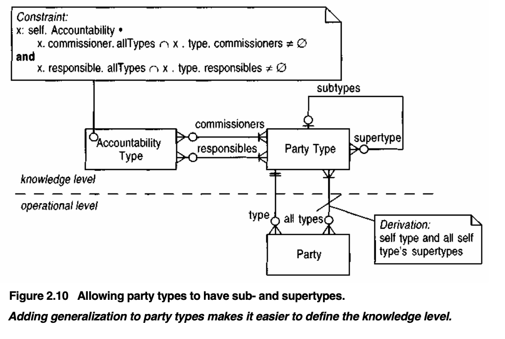

# Accountability Package

This project demonstrates the **Accountability** pattern as described in _Analysis Patterns_ by Martin Fowler, implemented in both Java and Python.

The implementation leverages the **reflection** pattern to separate the **operational level** from the **knowledge level**, ensuring greater flexibility and adaptability.

## Features

- **Support for subtyping**: The `Party` entity allows subtype extensions to accommodate different roles.
- **Flexible accountability relationships**: Models various relationships such as students, professors, full professors, and universities.
- **Comprehensive unit tests**: Includes test cases that validate the accountability model in a university scenario.

## Diagram

Below is a high-level diagram representing the **Accountability** pattern:

This repository provides a practical exploration of the **Accountability** pattern and its application in real-world modeling.
